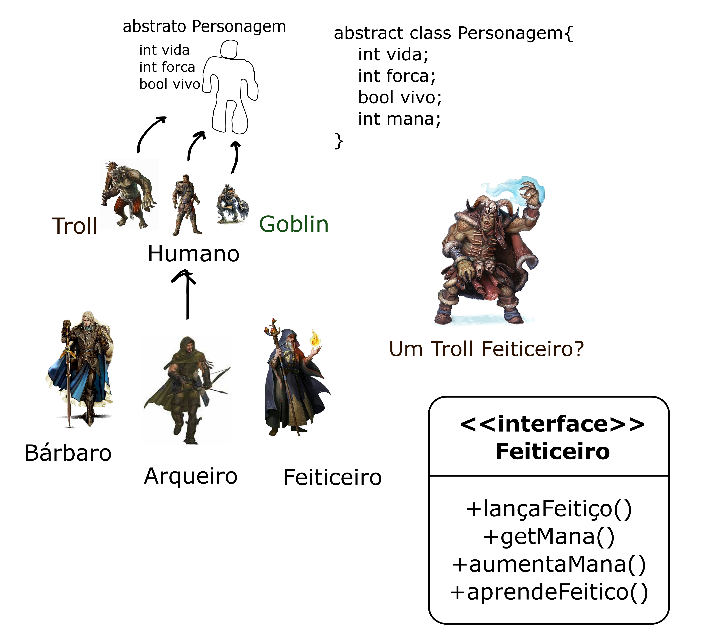

# UpRPG

## Repositório para introdução ao GitHub e exercício dos conceitos de **Herança** e **Interface**

A idéia é fazer um mini jogo de RPG no console que tenha 

- humanos
- goblins
- trolls
- etc...

que possam ser 
- feiticeiros
- bárbaros
- arqueiros
- etc...

Em que aproveitaremos os conceitos de Herança, Classes e Métodos Abstratos, Polimorfismo e Interfaces.

